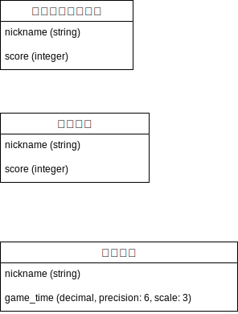

# README
# Brain Camp

## アプリケーション概要  
3種の脳トレゲームをプレイできるアプリケーションです。来場者向けに体験型のコンテンツとして制作しました。

---

## URL  
本アプリケーションはRenderを使用してデプロイされましたが、Renderの無料プランには制限があるため、必要に応じてローカル環境での動作確認を推奨します。

---

## 利用方法  
1. トップ画面からゲームを選択してプレイします。
2. リザルト画面にスコアが表示されます。
3. リザルト画面では以下の操作が可能です：
   - トップ画面に戻る
   - リトライ
   - ニックネームを登録
4. ニックネームを登録すると、トップ画面に遷移し、スコアが上位20位以内であればランキングに登録されます。

---

## アプリケーションを作成した背景
スクールのイベントで、4人のチームで来場者向けの体験型コンテンツを制作することになりました。そこで、年齢を問わず何度でも楽しんでいただけるもの、シンプルで短期間で制作できるものとして脳トレゲームのアプリを制作しました。

このプロジェクトは、以下のような初めての経験を伴う中で、学習しながら開発を進めました：

チーム開発: 初めてのチーム開発で役割分担を行い、タスクの連携や進捗管理を工夫しました。
GitHubのチーム利用: 初めてチームでGitHubを使用しました。基本的な操作を学びながらブランチ運用やプルリクエストの管理を実践しました。
JavaScript: 初歩的な知識からスタートし、ゲームロジックやアニメーションの実装に取り組みました。
Figma: 初めての利用で、デザインの知識がない中、UIのプロトタイピングや共有を行いました。
未経験の分野が多い中で、動作するアプリケーションを完成させることを目標にし、開発を進めました。

---


## 実装した機能についての画像やGIFおよびその説明

### トップ画面
スコアの上位20位以内はランキングに載ります。ランキングはポーリングで更新されます。ランキングで新しく登録されたニックネームには`NEW`と表示されます。

<div align="center">
  
</div>
<div align="center">
  
</div>

---

### 色勝ちじゃんけん
青の手には勝つとスコアを獲得、赤の手には負けるとスコアを獲得できます。コンボを繋げて追加スコアを獲得できます。

<div align="center">
  
</div>
<div align="center">
  
</div>

---

### 数の達人
4×4の数独ゲームでクリアまでのタイムを競います。縦・横そして2×2のブロック内では同じ数字を使用できません。初期の数字をヒントとして全てのマスを埋めていきます。

<div align="center">
  
</div>
<div align="center">
  
</div>

---

### 覚えマス
画面にランダムで表示される数字や位置を覚え、次々と出される「1つ前の数字は？」「2つ前の場所は？」といった質問に答える記憶力ゲームです。連続正解でスコアが倍増するフィーバーモードもあり、制限時間内で高得点を目指します。

<div align="center">
  
</div>
<div align="center">
  
</div>

---

### リザルト画面
ニックネームを登録することで、ランキングにスコアが登録されます。

<div align="center">
  
</div>

## 実装予定の機能  
今の所ありません

---

## データベース設計  

<div align="center">
  
</div>

### テーブル: `色勝ちじゃんけん`
| カラム名      | データ型   | オプション        |
|---------------|------------|-------------------|
| nickname      | string     |                   |
| score         | integer    |                   |

---

### テーブル: `覚えマス`
| カラム名      | データ型   | オプション        |
|---------------|------------|-------------------|
| nickname      | string     |                   |
| score         | integer    |                   |

---

### テーブル: `数の達人`
| カラム名      | データ型      | オプション          |
|---------------|---------------|---------------------|
| nickname      | string        |                     |
| game_time     | decimal(6, 3) |                     |


---

## 画面遷移図  
<div align="center">
  
</div>

---

## 開発環境
- **言語・フレームワーク**:  
  - Ruby 3.2.0  
  - Rails 7.0.0  
  - HTML5  
  - JavaScript  
  - CSS3

- **データベース**:  
  - 開発環境: MySQL  
  - テスト環境: MySQL  
  - 本番環境: PostgreSQL  

- **デプロイ先**:  
  - Render  

- **データベース管理ツール**:  
  - ローカル環境: Sequel Pro  
  - 本番環境: Table Plus  

- **デザインツール**:  
  - Figma  

- **開発ツール**:  
  - Visual Studio Code (VSCode)  
  - GitHub, GitHub Desktop  

- **チーム構成**:  
  - 4名  
    - 1人がトップ・リザルト画面、デザインを担当。  
    - 3人がそれぞれ1つのゲームを担当し、開発を分担。  

---

## 工夫したポイント
- **動作を最優先**  
  アプリケーションで重要視したのは「動作すること」です。来場者がゲームをプレイする際に、不具合やバグがない状態を確保することを最優先としました。プレイヤーにとってコードの最適化や効率性は直接見えないため、動作に影響しない範囲ではチーム全員が理解できる実装を選びました。その結果、コードに無駄や非効率的な部分が含まれることもありましたが、安定した動作を優先しました。

- **ユーザー体験のクオリティを優先**  
  外部の人が見ることを意識し、デザインやUI、ゲームそのもののクオリティを向上させることに力を入れました。また、各々が個性的なゲームの演出やチュートリアル動画を実装することで、プレイヤーがスムーズにゲームの流れを理解し、没入感を得られるよう工夫しました。

---

## ローカルでの動作方法
### 前提条件
以下のツールがインストールされていることを確認してください：
- Ruby 3.2.0
- Rails 7.0.0
- MySQL (または使用しているデータベース)
- Git

ローカルでの動作方法
リポジトリをクローンする
リポジトリをGitHubからローカル環境にクローンします。

```git clone https://github.com/taichomeiso/Brain_Camp cd Brain_Camp ```

必要なGemをインストール
アプリケーションが依存するGemをインストールします。

``` bundle install ```

データベースをセットアップ
以下のコマンドを順に実行して、データベースを作成・マイグレーション・Seedデータを投入します。

``` rails db:create rails db:migrate rails db:seed ```

サーバーを起動
Railsサーバーを起動します。

``` rails server ```

ブラウザでアプリケーションを開く
サーバー起動後、以下のURLをブラウザで開いてアプリケーションを確認します。

``` http://localhost:3000 ```


---


## 改善点
学習進捗に差があるメンバーがいる中で、全員が理解できる手法を採用しました。そのため、コードに無駄や非効率的な部分が含まれています。

アプリケーションの実装中に「color_rock_paper_sicissors」というスペルミスが含まれていましたが、動作に影響がないため修正せずにその名称を使用しました。

来場者向けコンテンツで操作をシンプルにするため、ニックネームの登録のみにしました。ただし、同じニックネームを登録できない仕様としたため、複数回プレイする人が不便に感じる場合がありました。想定外だったのは、多くの来場者が「あああ」など適当なニックネームではなく個別のニックネームを登録していたことです。

このアプリケーションは、1440×900のビューポートサイズを前提に設計されています。そのため、異なる解像度やフルスクリーン以外で表示すると、レイアウトが崩れる可能性があります。

スクールのイベントでの使用を想定していたため、特定のマシン（MacBook Air Retina 13インチ (2018)）で動作確認を行いました。他のPCやデバイスで使用する際、想定通り動作しない場合があります。

---

## 制作期間
2024年10月11日 ～ 2024年11月21日